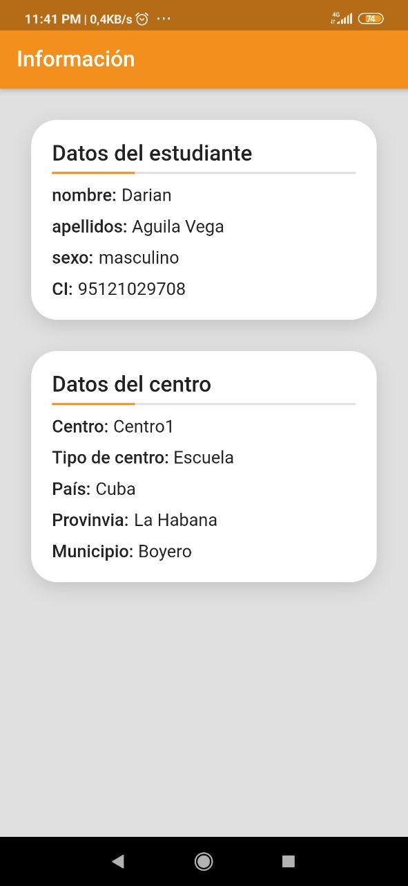

# AKADEMO-APK

 
 

# Pre-requirements
- Install Ubuntu 18.04 64bit
- Install Flutter

# Manual install (developers)
- `git clone https://gitlab.prod.uci.cu/fortes/akademos-apk.git`
- `cd akademos-apk`
- `flutter pub get`
- `flutter run`